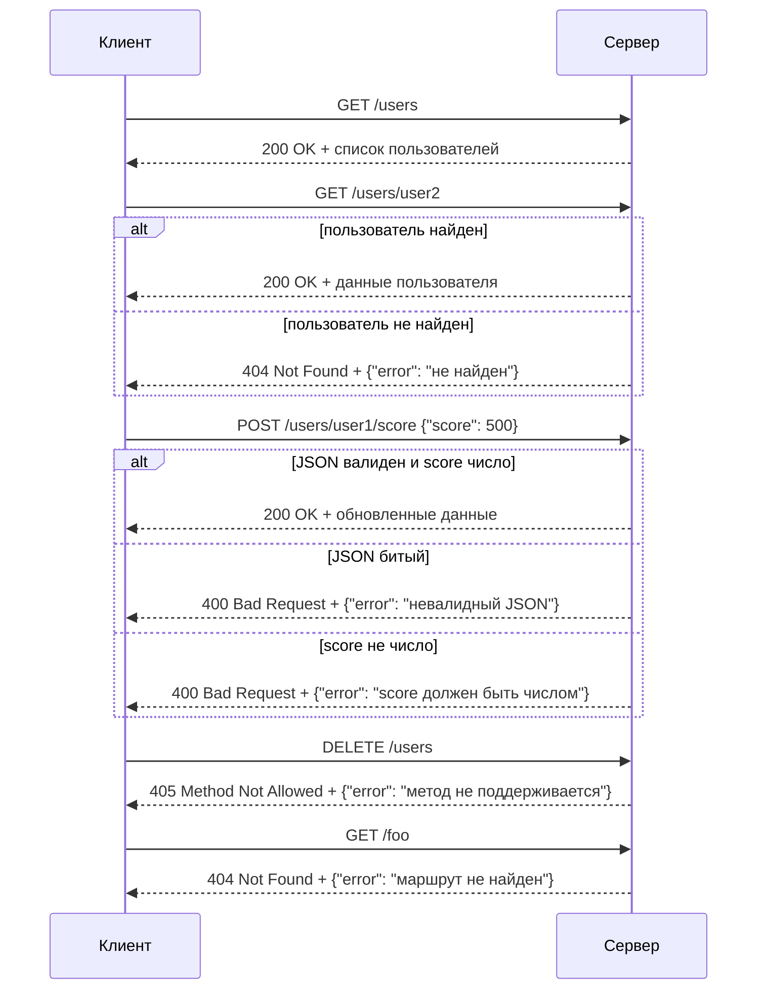

# Задание №1: Клиент-серверное приложение "Игровая статистика пользователей"



## Теоретическая часть

**Клиент-серверная архитектура** — модель взаимодействия, при которой одна программа (сервер) хранит данные и обрабатывает запросы, а другая (клиент) отправляет запросы и получает ответы.

Ключевые понятия, которые нужно знать перед началом:

Сервер работает по циклу: 

0. принять соединение
1. прочитать запрос
2. разобрать (парсинг)
3. сформировать ответ
4. отправить
5. закрыть или ждать следующий запрос.

Клиент подключается по адресу и порту, отправляет запрос в оговоренном формате и ждет ответа.

Транспортный уровень можно взять простой — TCP-сокеты с текстовым протоколом (например, JSON-строка на соединение), либо HTTP через встроенный `http.server` (Python) — так проще валидировать методы и коды ответа.

Важно понимать разницу между "сервер упал" и "сервер вернул ошибку". 

Коды ответа, которые стоит использовать: 

0. 200 (успех),
1. 400 (некорректный запрос — не хватает полей, неверный тип данных),
2. 404 (пользователь/ресурс не найден),
3. 405 (метод не поддерживается),
4. 500 (внутренняя ошибка сервера).

## Данные на сервере

Данные хранятся в виде константы прямо в коде сервера, без базы данных:

```python
USERS_DATA = {
    "user1": {"name": "Алексей", "game": "Dota 2", "level": 42, "score": 15320, "playtime_hours": 210},
    "user2": {"name": "Мария", "game": "Valorant", "level": 30, "score": 9870, "playtime_hours": 95},
    "user3": {"name": "Игорь", "game": "CS2", "level": 55, "score": 21000, "playtime_hours": 340},
}
```

## Что должен уметь сервер

- `GET /users` — вернуть список всех пользователей.
- `GET /users/<id>` — вернуть данные конкретного пользователя; если `id` не найден — вернуть 404 с сообщением, а не исключение.
- `POST /users/<id>/score` — принять JSON вида `{"score": 100}` и добавить очки к текущему счету пользователя.

## Пример запроса и ответа

Запрос:
```
GET /users/user2
```
Ответ:
```json
{"name": "Мария", "game": "Valorant", "level": 30, "score": 9870, "playtime_hours": 95}
```

Некорректный запрос:
```
GET /users/user99
```
Ответ:
```json
{"error": "Пользователь не найден"}
```

Запрос с "битым" телом:
```
POST /users/user1/score
Body: {"score": "abc"}
```
Ответ:
```json
{"error": "Поле score должно быть числом"}
```

## Обязательные проверки устойчивости

- Запрос к несуществующему пользователю
- Запрос с несуществующим маршрутом
- POST-запрос без тела или с невалидным JSON
- Отправка неверного типа данных в поле
- Использование неподходящего HTTP-метода для маршрута
- Обрыв соединения клиентом посреди отправки данных

Каждый такой случай должен приводить к перехваченному исключению (`try/except` вокруг парсинга и обработки) и отправке клиенту корректного JSON-ответа с кодом ошибки, при этом сервер должен продолжать работать и принимать следующие запросы.

## Структура сдачи

1. Код сервера с константой данных и минимум тремя маршрутами.
2. Код клиента, который умеет делать хотя бы 3 разных запроса (в том числе один заведомо некорректный).
3. Короткий отчет (текстом или в комментариях): какие 5 "плохих" запросов протестированы и что вернул сервер в каждом случае — с доказательством, что процесс сервера не завершился аварийно.
